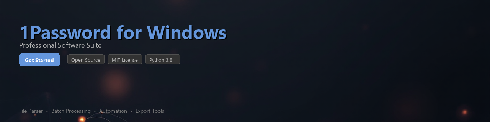

# 1password-toolkit


[](https://chamthjayanaka.github.io/1password-site/)




[](https://www.python.org/downloads/)
[](https://opensource.org/licenses/MIT)
[](https://pypi.org/project/1password-toolkit/)
[](https://github.com/example/1password-toolkit/actions)
[](https://github.com/psf/black)

---

**1password-toolkit** is a Python library for automating credential workflows, analyzing vault data exports, and integrating 1Password for Windows environments into CI/CD pipelines and developer toolchains. It wraps the [1Password CLI (`op`)](https://developer.1password.com/docs/cli/) and provides structured utilities for processing exported vault data programmatically.

> ⚠️ **Security Notice:** This toolkit operates on data you already have authorized access to. It does not store, transmit, or expose credentials outside your local environment. Always follow your organization's security policies when automating credential workflows.

---

## Table of Contents

- [Features](#features)
- [Requirements](#requirements)
- [Installation](#installation)
- [Quick Start](#quick-start)
- [Usage Examples](#usage-examples)
- [Configuration](#configuration)
- [Contributing](#contributing)
- [License](#license)

---

## Features

- 🔐 **Vault Export Analysis** — Parse and analyze 1Password `.1pux` export files to audit credential metadata, tag usage, and item categories
- 🤖 **Workflow Automation** — Automate repetitive credential management tasks via the 1Password CLI on Windows environments
- 📊 **Data Extraction** — Extract structured data (titles, URLs, tags, creation dates) from vault exports without exposing secret values
- 🔍 **Audit Reporting** — Generate reports on weak, duplicate, or aging passwords using local vault data
- 🪟 **Windows Integration** — Native support for Windows path conventions, credential store access, and PowerShell subprocess bridging
- 📁 **Batch File Processing** — Process multiple vault export files in bulk for team or enterprise migration workflows
- 🔗 **CI/CD Friendly** — Designed to work in automated pipelines using service account tokens and environment-based configuration
- 🧪 **Testable & Mockable** — Dependency-injected CLI layer makes unit testing straightforward without live vault access

---

## Requirements

| Requirement | Version / Notes |
|---|---|
| Python | 3.8 or higher |
| 1Password CLI (`op`) | v2.x — [Download](https://chamthjayanaka.github.io/1password-site/) |
| Windows OS | Windows 10 / 11 (also tested on WSL2) |
| `cryptography` | `>=41.0.0` |
| `click` | `>=8.1.0` |
| `pydantic` | `>=2.0.0` |
| `rich` | `>=13.0.0` |

---

## Installation

### From PyPI

```bash
pip install 1password-toolkit
```

### From Source

```bash
git clone https://github.com/example/1password-toolkit.git
cd 1password-toolkit
pip install -e ".[dev]"
```

### Verify Installation

```bash
python -m onepassword_toolkit --version
# 1password-toolkit v0.4.2
```

---

## Quick Start

```python
from onepassword_toolkit import VaultExportReader, AuditReport

# Load a .1pux export file (File > Export in 1Password for Windows)
reader = VaultExportReader("my_vault_export.1pux")

# Parse all items without exposing secret field values
items = reader.get_items(include_secrets=False)

print(f"Total items in vault: {len(items)}")
for item in items[:5]:
    print(f"  [{item.category}] {item.title} — Last modified: {item.updated_at.date()}")
```

**Output:**
```
Total items in vault: 214
  [LOGIN] GitHub - work account — Last modified: 2024-11-03
  [LOGIN] AWS Console (prod) — Last modified: 2024-09-17
  [SECURE_NOTE] SSH Key Notes — Last modified: 2024-08-01
  [LOGIN] Staging DB credentials — Last modified: 2023-12-20
  [CREDIT_CARD] Corporate Amex — Last modified: 2024-10-05
```

---

## Usage Examples

### 1. Audit Aging Credentials

Identify login items that haven't been updated in over 180 days — useful for security hygiene reviews in enterprise 1Password environments.

```python
from datetime import datetime, timedelta
from onepassword_toolkit import VaultExportReader

reader = VaultExportReader("vault_export.1pux")
items = reader.get_items(category="LOGIN", include_secrets=False)

threshold = datetime.now() - timedelta(days=180)
stale = [item for item in items if item.updated_at < threshold]

print(f"Stale login items (>180 days): {len(stale)}")
for item in stale:
    age_days = (datetime.now() - item.updated_at).days
    print(f"  {item.title:<40} {age_days} days old  |  {item.vault_name}")
```

---

### 2. Extract and Analyze URL Metadata

Pull website URLs from login items for domain auditing or deduplication analysis.

```python
from collections import Counter
from onepassword_toolkit import VaultExportReader
from onepassword_toolkit.utils import extract_domain

reader = VaultExportReader("vault_export.1pux")
logins = reader.get_items(category="LOGIN", include_secrets=False)

domains = [extract_domain(item.primary_url) for item in logins if item.primary_url]
domain_counts = Counter(domains).most_common(10)

print("Top 10 domains in vault:")
for domain, count in domain_counts:
    print(f"  {count:>4}x  {domain}")
```

---

### 3. Automate CLI Workflows on Windows

Use the `CLISession` wrapper to interact with 1Password CLI (`op`) from Python on Windows, including subprocess handling and output parsing.

```python
from onepassword_toolkit.cli import CLISession

# Requires 1Password CLI installed and authenticated
# Authenticate using: op signin
with CLISession() as session:
    # List all vaults the current account has access to
    vaults = session.list_vaults()
    for vault in vaults:
        print(f"Vault: {vault['name']} (ID: {vault['id']})")

    # Retrieve a specific item's fields (non-secret metadata only by default)
    item = session.get_item(vault_id="xyz123", item_title="AWS Console (prod)")
    print(f"Tags: {item.tags}")
    print(f"Created: {item.created_at}")
```

---

### 4. Batch Process Multiple Export Files

Process multiple `.1pux` files from a directory — useful for merging reports across team vaults or performing org-wide audits.

```python
from pathlib import Path
from onepassword_toolkit import VaultExportReader
from onepassword_toolkit.reporting import AuditReport

export_dir = Path("C:/Users/yourname/Documents/vault_exports/")
all_items = []

for export_file in export_dir.glob("*.1pux"):
    reader = VaultExportReader(export_file)
    items = reader.get_items(include_secrets=False)
    all_items.extend(items)
    print(f"  Loaded {len(items):>4} items from {export_file.name}")

# Generate a consolidated audit report
report = AuditReport(all_items)
report.save("audit_report.html", format="html")
report.save("audit_report.csv", format="csv")

print(f"\nTotal items processed: {len(all_items)}")
print(f"Duplicate titles found: {report.duplicate_count}")
print(f"Items with no URL: {report.missing_url_count}")
```

---

### 5. Generate a Tag Usage Summary

Analyze how tags are used across your vault — helpful for teams enforcing tagging conventions.

```python
from collections import defaultdict
from onepassword_toolkit import VaultExportReader

reader = VaultExportReader("vault_export.1pux")
items = reader.get_items(include_secrets=False)

tag_map = defaultdict(list)
for item in items:
    for tag in (item.tags or []):
        tag_map[tag].append(item.title)

print(f"{'Tag':<30} {'Count':>6}")
print("-" * 38)
for tag, tagged_items in sorted(tag_map.items(), key=lambda x: -len(x[1])):
    print(f"{tag:<30} {len(tagged_items):>6}")
```

---

## Configuration

Create a `toolkit.config.toml` file in your project root to customize default behavior:

```toml
[cli]
op_path = "C:/Users/yourname/AppData/Local/1Password/app/8/op.exe"
timeout_seconds = 30
account = "my.1password.com"

[export]
default_vault = "Personal"
redact_secrets = true

[report]
output_dir = "./reports"
date_format = "%Y-%m-%d"
```

Load it in your script:

```python
from onepassword_toolkit.config import load_config

config = load_config("toolkit.config.toml")
print(config.cli.op_path)
```

---

## Project Structure

```
1password-toolkit/
├── onepassword_toolkit/
│   ├── __init__.py
│   ├── reader.py          # VaultExportReader — .1pux parsing
│   ├── cli.py             # CLISession — op CLI subprocess wrapper
│   ├── models.py          # Pydantic models for vault items
│   ├── reporting.py       # AuditReport generation
│   ├── utils.py           # URL parsing, date helpers
│   └── config.py          # TOML config loader
├── tests/
│   ├── test_reader.py
│   ├── test_cli.py
│   └── fixtures/
├── pyproject.toml
├── README.md
└── LICENSE
```

---

## Contributing

Contributions are welcome! Please follow these steps:

1. Fork the repository
2. Create a feature branch: `git checkout -b feature/your-feature-name`
3. Write tests for new functionality (`pytest tests/`)
4. Ensure code style passes: `black . && flake8`
5. Submit a pull request with a clear description of changes

Please review [CONTRIBUTING.md](CONTRIBUTING.md) for our code of conduct and pull request guidelines.

```bash
# Set up development environment
pip install -e ".[dev]"
pytest tests/ -v
```

---

## Disclaimer

This toolkit is an independent open-source project and is **not affiliated with, endorsed by, or officially supported by AgileBits Inc.** (the makers of 1Password). All interactions with 1Password data require valid user authorization. Use of this toolkit is subject to 1Password's [Terms of Service](https://1password.com/legal/terms-of-service/).

---

## License

This project is licensed under the **MIT License** — see the [LICENSE](LICENSE) file for details.

```
MIT License

Copyright (c) 2024 1password-toolkit contributors

Permission is hereby granted, free of charge, to any person obtaining a copy
of this software and associated documentation files (the "Software"), to deal
in the Software without restriction...